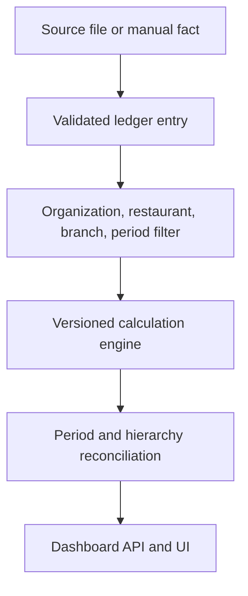

# Financial data lineage and audit contract

Every Restrova financial figure must be reproducible from scoped ledger facts. The dashboard and AI layers consume calculated results; they do not create replacement numbers.



## Ledger evidence

Every financial entry contains:

| Field              | Audit purpose                                                                |
| ------------------ | ---------------------------------------------------------------------------- |
| `organization_id`  | Tenant boundary                                                              |
| `restaurant_id`    | Restaurant ownership                                                         |
| `branch_id`        | Optional branch attribution; `null` means restaurant-level unallocated input |
| `category`         | Deterministic formula semantics                                              |
| `amount_minor`     | Integer source amount                                                        |
| `currency_code`    | Historical currency contract                                                 |
| `occurred_at`      | Event instant used for period inclusion                                      |
| `period_start/end` | Optional source coverage period, stored without invented allocation          |
| `source_type`      | `manual`, `import`, or `system`                                              |
| `source_reference` | Required source identity and retry/deduplication key                         |
| `evidence`         | Small safe facts such as invoice or POS references                           |
| `created_by`       | Authenticated writer                                                         |

The scoped unique source key prevents a retry from creating a second business fact. Evidence must not contain credentials, tokens, or raw uploaded datasets.

## Calculation lineage

Calculation responses group distinct references by every ledger category:

```json
{
  "sales": [
    {
      "sourceType": "import",
      "sourceReference": "POS-ORDER-1042"
    }
  ],
  "food_costs": [
    {
      "sourceType": "manual",
      "sourceReference": "INVOICE-FOOD-88"
    }
  ]
}
```

Hierarchical report and dashboard responses additionally include `restaurantId` and `branchId`. Source references are deduplicated by restaurant, branch, source type, and reference so an identical external order number in two branches remains two scoped facts.

## Completeness

Every calculation includes:

- `hasData`: whether any ledger entry exists in scope;
- `entryCount`: number of scoped entries used;
- `presentCategories`: categories with one or more facts;
- `missingCategories`: supported categories with no facts.

Completeness describes connected evidence, not real-world certainty. For example, missing `rent` means “no rent fact was available,” not “rent was zero.” Consumers must preserve this warning when presenting profitability.

## Period trace

Responses expose inclusive `from` and `to` instants plus the IANA timezone used to resolve presets. Comparisons retain separate completeness and lineage. Trend points also retain their own period, entry count, and lineage rather than inheriting the whole report's evidence.

## Hierarchy and reconciliation

Branch entries are calculated independently. Rows without `branch_id` remain `unallocated`. Restaurant and organization totals are recalculated from complete ledger facts, then reconciled against child totals for additive metrics and entry counts.

Ratios and per-order metrics are not additive. They are recalculated using the consolidated numerator and denominator. Reconciliation metadata reports whether each additive identity holds; a failed identity is a release blocker.

## Authorization trace

- Owners may write ledger facts and access organization reports.
- Viewers have read-only restaurant and permitted branch access.
- Branch managers are forced to their assigned branch and cannot request broader scope.
- Unknown or cross-tenant identifiers return `404` to avoid disclosing resource existence.
- All queries include the authenticated organization. A client-supplied identifier never replaces that boundary.

## Drill-down procedure

To audit a displayed figure:

1. Record dashboard `scope`, `period`, `currencyCode`, formula/dashboard versions, and completeness.
2. Read the metric's category lineage references.
3. Query `GET /api/financial/entries` using the permitted branch and exact period.
4. Match `source_type` and `source_reference` back to the import job, POS export, invoice, or manual evidence.
5. Re-run `GET /api/financial/calculate` for the same scope and boundaries.
6. For organization or restaurant totals, verify the `reconciliation` result and inspect unallocated rows.

If a source cannot be recovered, mark the figure's evidence as incomplete; do not reconstruct it from an AI explanation or chart pixel.
